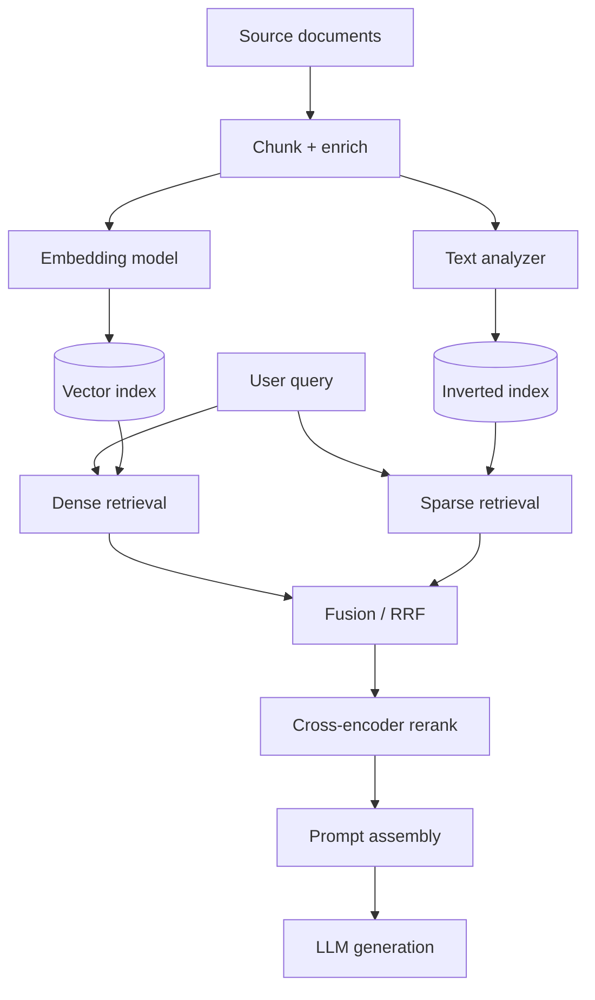

# RAG and hybrid search: a working reference

A practical breakdown of Retrieval Augmented Generation, what hybrid search adds, and a worked example for a customer support chatbot.

---

## 1. The three words

**Retrieval** — fetching text you already have. Given a question, search your own corpus and return the most relevant passages. No generation happens here. This is search, and its only job is to find the right evidence.

**Augmented** — the retrieved passages get inserted into the prompt *before* the model sees the question. You are augmenting the model's **input**, not its weights. Nothing is trained or fine-tuned. This is the word people skip, and it is the actual mechanism.

**Generation** — the model reads the assembled prompt and writes an answer in natural language, constrained to the evidence you pasted in.

> **RAG in one sentence:** search first, paste the results into the prompt, then let the model write the answer from them.

### What each part protects against

| Part | If it's weak | Symptom the user sees |
|---|---|---|
| Retrieval | wrong passages found | confident answer, wrong facts |
| Augmented | passages badly assembled or truncated | model ignores evidence it was given |
| Generation | no grounding or abstention instruction | model fills gaps from training memory |

---

## 2. The two pipelines

RAG is two pipelines, not one. The offline pipeline builds indexes; the online pipeline queries them.



### Offline (index time)

| Stage | What it does | Key decision |
|---|---|---|
| Load + parse | Extract text from PDFs, HTML, DB rows | Preserve structure (headings, tables) |
| Chunk | Split into retrievable units | 400–800 tokens, 10–20% overlap |
| Enrich | Attach metadata | `tenant_id`, `plan_tier`, `locale`, `updated_at` |
| Embed | Chunk → dense vector | Model choice, dimension, cost |
| Analyze | Chunk → tokens/stems | Stopwords, stemming, n-grams |
| Index | Write to both stores | Same `chunk_id` on both sides |

The shared `chunk_id` is what makes fusion possible later. If the two indexes disagree on identity, you cannot merge their results.

### Online (query time)

| Stage | What it does | Typical setting |
|---|---|---|
| Query prep | Rewrite, expand, resolve pronouns | Use conversation history |
| Dense retrieve | ANN search over vectors | top-50 |
| Sparse retrieve | BM25 over inverted index | top-50 |
| Fuse | Merge two ranked lists | RRF, k=60 |
| Rerank | Cross-encoder scoring | keep top-5 |
| Assemble | Build prompt with citation tags | question last |
| Generate | Model writes grounded answer | temperature 0–0.3 |

---

## 3. Hybrid search

Hybrid search means running **two different kinds of search on the same question and combining the results.**

| | Keyword (BM25) | Vector (dense) |
|---|---|---|
| Matches on | literal terms | meaning |
| Strong at | codes, SKUs, names, versions | paraphrase, intent, synonyms |
| Weak at | synonyms, rewording | near-identical strings |
| Example win | `ERR_4021` | "my payment bounced" → "transaction declined" |
| Cost | cheap | embedding call + ANN |

Neither is sufficient alone. Keyword search cannot handle paraphrase. Vector search blurs identifiers together — `ERR_4021` and `ERR_4012` sit almost on top of each other in embedding space.

### Reciprocal rank fusion

RRF throws away raw scores and uses only positions, so you never have to normalize a bounded cosine against an unbounded BM25 score.

```
score(doc) = Σ over retrievers  1 / (k + rank_r(doc))     # k ≈ 60
```

Worked example:

| Chunk | Dense rank | Sparse rank | RRF score | Fused |
|---|---|---|---|---|
| C3 | 2 | 1 | 1/62 + 1/61 = **0.0325** | 1 |
| C7 | 1 | 3 | 1/61 + 1/63 = **0.0323** | 2 |
| C11 | — | 2 | 1/62 = **0.0161** | 3 |
| C9 | 3 | — | 1/63 = **0.0159** | 4 |

`C7` was the dense arm's top hit, but `C3` wins because **both arms agreed on it**. Cross-retriever agreement is treated as evidence.

The alternative is weighted score fusion — `α · norm(dense) + (1−α) · norm(bm25)` — which gives you a tunable α but forces score normalization. Start with RRF; move to weighted fusion only when you have eval data showing one arm should dominate.

---

## 4. Worked example: customer support chatbot

Support queries are where hybrid genuinely matters, because they mix natural language and exact strings in the same sentence.

### The incoming message

> "my order keeps failing at checkout, it says ERR_4021 and my card is fine"

### What each arm finds

**Vector search** understands *"keeps failing at checkout"* and *"my card is fine"*:

| Rank | Chunk | Source |
|---|---|---|
| 1 | "Common causes of declined transactions" | help center |
| 2 | Ticket #8871 — "checkout won't complete, card works elsewhere" | resolved tickets |
| 3 | "Understanding payment authorization holds" | help center |

**Keyword search** locks onto the literal token `ERR_4021`:

| Rank | Chunk | Source |
|---|---|---|
| 1 | "ERR_4021: address verification mismatch — resolution steps" | runbook |
| 2 | Ticket #9102 — "ERR_4021 on repeat orders" | resolved tickets |

### Why you need both

- Vector alone **misses the runbook** — `ERR_4021` carries almost no semantic signal, and its neighbours in embedding space are other error codes.
- Keyword alone **misses the resolved tickets and the AVS context** — none of them contain that exact string, and the customer never used the words "address verification."

Fused, the bot gets the specific fix *and* the surrounding explanation, so the answer can say what to do and why the card being valid is not a contradiction.

### Corpora to index

| Corpus | Why | Notes |
|---|---|---|
| Resolved tickets | Written in customer vocabulary | Usually the **highest-value** corpus |
| Help center articles | Canonical, approved wording | Written in doc-team vocabulary |
| Internal runbooks | Error codes, exact procedures | Must be permission-gated |
| Policy docs | Refunds, warranties, SLAs | Version and date these carefully |

The most common mistake in support RAG is indexing only the help center.

### Chunk schema

```json
{
  "chunk_id": "kb_4021_runbook#c2",
  "text": "ERR_4021 indicates an address verification mismatch...",
  "source_type": "runbook",
  "source_url": "https://internal/runbooks/err-4021",
  "title": "ERR_4021: address verification mismatch",
  "plan_tier": ["free", "pro", "enterprise"],
  "locale": "en",
  "audience": "internal",
  "updated_at": "2026-05-02",
  "embedding": [0.0134, -0.0221, "..."]
}
```

### Retrieval with RRF

```python
K_RRF = 60
FETCH_PER_ARM = 50
KEEP_AFTER_RERANK = 5


def hybrid_retrieve(query: str, filters: dict) -> list[dict]:
    """Fan out to both arms, fuse by reciprocal rank, then rerank."""

    # Filters are pushed INTO both searches, never applied afterwards.
    dense = vector_store.search(
        vector=embed(query),
        top_k=FETCH_PER_ARM,
        filter=filters,
    )
    sparse = text_store.search(
        query=query,
        top_k=FETCH_PER_ARM,
        filter=filters,
    )

    scores: dict[str, float] = {}
    lookup: dict[str, dict] = {}

    for arm in (dense, sparse):
        for rank, hit in enumerate(arm, start=1):
            cid = hit["chunk_id"]
            scores[cid] = scores.get(cid, 0.0) + 1.0 / (K_RRF + rank)
            lookup[cid] = hit

    fused = sorted(scores, key=scores.get, reverse=True)
    candidates = [lookup[cid] for cid in fused[:FETCH_PER_ARM]]

    reranked = cross_encoder.score(query, candidates)
    return reranked[:KEEP_AFTER_RERANK]
```

**Filter placement matters.** Applying `plan_tier` or `audience` *after* fusion means you fetch 100 candidates and might have 3 left that the customer is allowed to see. Push the filter into both searches — every mainstream vector store supports filtered ANN now.

### Query preparation for multi-turn chat

Support conversations are full of pronouns. Retrieval on the raw last message fails constantly.

```
Turn 1  customer: "my checkout keeps failing with ERR_4021"
Turn 2  customer: "does that mean my card is blocked?"
```

Embedding "does that mean my card is blocked?" retrieves generic card-blocking articles. Rewrite against history first:

```python
def rewrite(history: list[dict], message: str) -> str:
    return llm(
        system=(
            "Rewrite the user's latest message into a standalone search query. "
            "Resolve pronouns using the conversation. Preserve error codes, "
            "order numbers, and SKUs exactly as written. Output only the query."
        ),
        messages=history + [{"role": "user", "content": message}],
    )

# → "does ERR_4021 at checkout mean the customer's card is blocked"
```

Preserving literal identifiers in the rewrite is essential — a rewrite that paraphrases `ERR_4021` away destroys the keyword arm.

### Prompt assembly

```python
PROMPT = """You are a support assistant for {company}.

Answer using ONLY the sources below. Cite them inline as [1], [2].

If the sources do not contain the answer, say so plainly and offer to
connect the customer to a human agent. Never guess at refund windows,
warranty terms, delivery dates, or account status.

Sources:
{sources}

Customer question: {question}"""


def build_prompt(question: str, chunks: list[dict], company: str) -> str:
    sources = "\n\n".join(
        f"[{i}] ({c['source_type']} — {c['title']})\n{c['text']}"
        for i, c in enumerate(chunks, start=1)
    )
    return PROMPT.format(company=company, sources=sources, question=question)
```

Three things earn their keep:

1. **Tag every chunk with a citable id.** Without ids, citations become plausible-sounding guesses and you lose the ability to verify or debug.
2. **Put the question last.** Attention is most reliable at the start and end of a long context; the middle degrades. Highest-ranked chunks go first, the question goes after the evidence.
3. **Instruct abstention explicitly.** This turns retrieval failure into *visible* failure rather than a hallucination.

### Expected answer

> Your card is almost certainly fine — `ERR_4021` is an address verification mismatch, not a decline by your bank [1]. The billing address on the order has to match what your card issuer has on file, including apartment number and postcode formatting. Updating the billing address at checkout and retrying usually clears it [1]. If it still fails after that, the authorization hold from the earlier attempt may need to expire first, which takes up to 7 days [3].
>
> Sources: [1] ERR_4021 runbook · [3] Understanding payment authorization holds

Note that this answer is only possible because both arms contributed: the runbook supplied the diagnosis, the semantically retrieved article supplied the authorization-hold caveat.

---

## 5. Configuration defaults

Reasonable starting points. Tune with eval data, not intuition.

| Knob | Start with | Move it when |
|---|---|---|
| Chunk size | 500 tokens | Answers get truncated mid-procedure |
| Chunk overlap | 15% | Boundary-spanning facts are missed |
| Fetch per arm | 50 | Rerank input lacks the right doc |
| RRF `k` | 60 | Lower k = trust top ranks more |
| Keep after rerank | 5 | Answers are thin, or context is bloated |
| Temperature | 0.2 | Answers feel robotic or wander |
| Recency boost | none | Stale policy docs win over current ones |

Ordered by typical payoff: **reranking → chunking → fetch depth → fusion weighting.**

---

## 6. Failure modes

| Symptom | Likely cause | Fix |
|---|---|---|
| Right doc exists, never retrieved | chunk too large, answer buried | smaller chunks, header-aware splitting |
| Error codes retrieve wrong runbook | dense-only retrieval | add the sparse arm |
| Bot cites an enterprise policy to a free user | filters applied post-fusion | push filters into both searches |
| Follow-up questions retrieve garbage | no query rewriting | rewrite against history |
| Confident wrong answers | no abstention instruction | explicit "say so" clause + eval on unanswerable questions |
| Answer ignores a provided source | source buried mid-context | rerank harder, keep fewer chunks |
| Stale refund terms quoted | no recency handling | filter or boost on `updated_at` |

---

## 7. Evaluation

Evaluate retrieval and generation **separately**, or you will not know which half is broken.

**Retrieval metrics** — build a set of ~100 real support questions with the correct `chunk_id` labelled:

- `recall@50` before rerank — is the right chunk even a candidate?
- `precision@5` after rerank — is it near the top?
- `MRR` — how high, on average?

**Generation metrics** — on the same set:

- **Faithfulness**: is every claim supported by a cited chunk?
- **Citation accuracy**: do the tags point at chunks that actually support the sentence?
- **Abstention rate on unanswerable questions**: deliberately include ~20 questions your corpus cannot answer. A bot that answers them all is worse than one that answers none.

Track abstention correctness as a first-class metric. In support specifically, an invented refund window becomes a chargeback.
